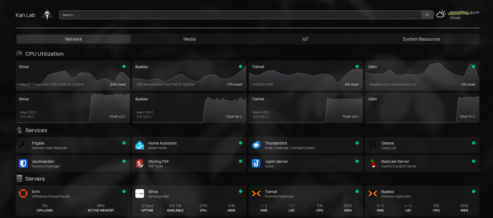

# 🏠 Homelab



The purpose of my homelab is to learn and to have fun - where I can try out and experiment with technology. I place an emphasis on hosting my own privacy-focused alternatives to the typical "free" cloud services.

Feel free to explore, use, and modify these files to suit your own homelab needs!

## Table of Contents
1. [Introduction](#introduction)
2. [Project Structure](#project-structure)
3. [Hardware Stack](#hardware-stack)
4. [Services](#services)
5. [Configuration](#configuration)
6. [License](#license)
7. [Contact](#contact)

## Introduction
This repository aims to simplify the setup and management of my containerized services by collecting various container configurations, utilities, and automation scripts used to manage and orchestrate services within my homelab environment. Each service has its own directory containing a docker-compose.yml file and any necessary supporting files (ex: environment variable templates). Adding version control to these container configurations will protect me from myself when I inevitably fiddle around with them and they break.

## Project Structure
```
homelab/
│
├─ docker-compose/
│  ├─ <service-name>/
│  │  ├─ docker-compose.yml
│  │  ├─ .env.example
│  │  └─ ...
│  └─ ...
└─ ...
```
## Hardware Stack

* **"Kirin"**: Topton N100 Mini PC running OPNsense (Router/Firewall/DHCP/DNS)
* **"Byakko"**: Minisforum MS-01 running Proxmox (Primary Hypervisor)
* **"Tiamat"**: Beelink S12 Pro running Proxmox (Secondary Hypervisor)
* **"Shiva"**: Synology DS1019+ (NAS)
* **"Odin"**: Raspberry Pi 4B (Offsite Backup Target)
  
## Services
<table>
    <tr>
        <th>Logo</th>
        <th>Name</th>
        <th>Service Description</th>
    </tr>
    <tr>
        <td></td>
        <td><a href="http://warrior.archiveteam.org/">ArchiveTeam-Warrior</a></td>
        <td>Virtual appliance to help with the ArchiveTeam archiving efforts</td>
    </tr>
    <tr>
        <td></td>
        <td><a href="https://github.com/cloudflare/cloudflared">Cloudflared</a></td>
        <td>Proxies traffic from Cloudflare to my exposed services without port forwarding.</td>
    </tr>
    <tr>
        <td></td>
        <td><a href="https://github.com/blakeblackshear/frigate">Frigate</a></td>
        <td>Local NVR with AI object detection + Notifications</td>
    </tr>
    <tr>
        <td></td>
        <td><a href="https://github.com/gethomepage/homepage">Homepage</a></td>
        <td>My custom homepage for homelab services</td>
    </tr>
    <tr>
        <td></td>
        <td><a href="https://github.com/immich-app/immich">Immich</a></td>
        <td>Automated private photo backup and management</td>
    </tr>
    <tr>
        <td></td>
        <td><a href="https://github.com/laurent22/joplin">Joplin</a></td>
        <td>Privacy-focused note taking app with sync capabilities</td>
    </tr>
    <tr>
        <td></td>
        <td><a href="https://github.com/NginxProxyManager/nginx-proxy-manager">NPM</a></td>
        <td>Nginx reverse proxy for homelab services with SSL termination and a pretty UI</td>
    </tr>
    <tr>
        <td></td>
        <td><a href="https://github.com/ollama/ollama">Ollama</a></td>
        <td>Local AI LLM + a Web UI</td>
    </tr>
    <tr>
        <td></td>
        <td><a href="https://github.com/paperless-ngx/paperless-ngx">Paperless-Ngx</a></td>
        <td>Searchable document management system</td>
    </tr>
    <tr>
        <td></td>
        <td><a href="https://github.com/Kozea/Radicale">Radicale</a></td>
        <td>Simple CalDAV (calendar) and CardDAV (contact) server</td>
    </tr>
    <tr>
        <td></td>
        <td><a href="https://github.com/searxng/searxng">SearXNG</a></td>
        <td>Aggregates results from various search services + a VPN proxy</td>
    </tr>
    <tr>
        <td></td>
        <td><a href="https://github.com/louislam/uptime-kuma">Uptime-Kuma</a></td>
        <td>Availability monitoring and alerting for internal services</td>
    </tr>
    <tr>
        <td></td>
        <td><a href="https://github.com/dani-garcia/vaultwarden">Vaultwarden</a></td>
        <td>Syncronized password vault + Secure backup solution</td>
    </tr>

</table>
  
## Configuration
Each service directory contains a docker-compose.yml file and (if required) a .env.example file which can be customized to fit your needs. Common env configurations include:

* IPs / Ports
* Hostnames / Domains
* Usernames / Passwords

Modify these settings according to your specific requirements before starting the services.

## License 
This project is licensed under the MIT License. See the [LICENSE](https://github.com/vfedetz/homelab/blob/main/LICENSE) file for details.

## Contact
For questions, suggestions, or feedback, please open an issue on GitHub or contact me at github@kan.ninja.
